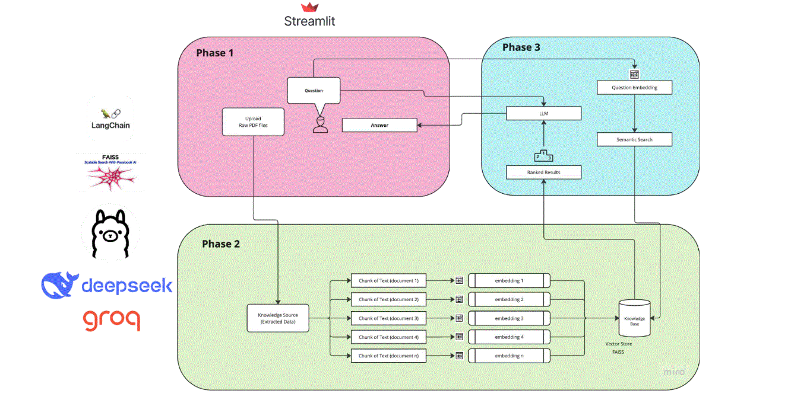

# AI Lawyer
This is a reasoning AI chatbot that uses Deepseek R1

### Phase 1 -> Setup streamlit app for UI
* Chatbot skeleton (Question & Answer)

### Phase 2 -> Setup Vector Database (Memory for LLM)
* Upload & load raw pdf file
* Create chunks
* Setup Embedding model (Used Deepseek R1 using Ollama)
* Store vector embeddings in FAISS database

### Phase 3 -> Setup rag pipeline (Connect Memory with LLM)
* Setup LLM (Use Deepseek R1 using Groq)
* Retrieve docks and perform similarity search then generate answers with reasoning
